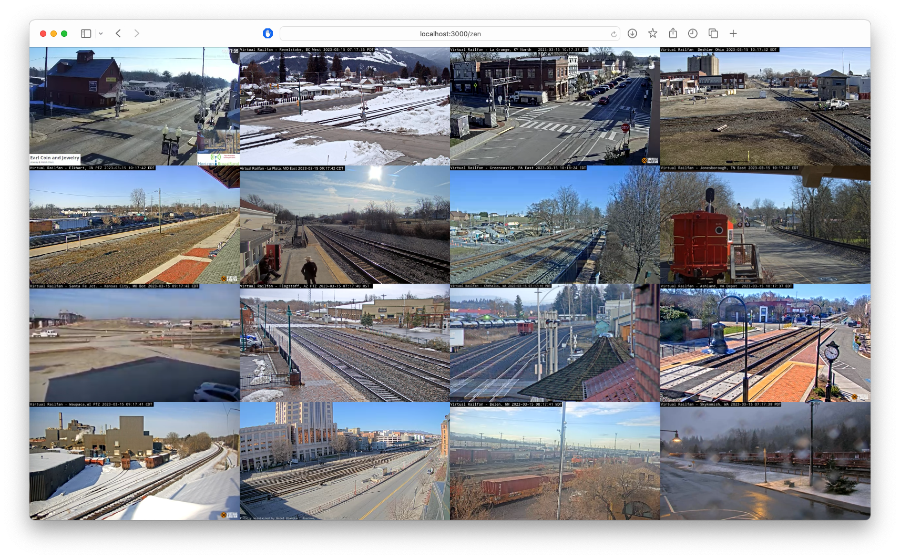

# Zen Mode

Zen Mode is a website which allows you to format individual websites or individual youtube videos into a high level view, and then share the link with your friends. **Currently this is limited to youtube videos, but I am working on adding support for more video sites and entire websites.**

## Why

Sometimes I find myself at my computer monitor trying to manage multiple sites or video streams in different tabs. I wanted to create a website which would allow me to format the iframe sites into a single window, and then share the link with my friends.

## Use Cases

Here are a few use cases I can think of:

- Breaking news: You want to watch multiple videos and fullscreen the one that is most interesting to you.
- Monitoring: You want to monitor multiple live streams like Train Cam footage, or a live stream of a city? 
- Collaborative Coding: An open window in an online IDE, docs site, and live preview.
- Sharing: You want to share a URL of multiple videos with your friends? Zen mode lets you do that!

## Note

- Not all sites are supported. If you find a site that is not supported, please open an issue and I will try to add support for it.
- Autoplay is currently disabled in Safari and iOS. I am working on a solution to this problem.

Star and watch the [repo]() to get updates on new features!

## How to use

- Go to the website: https://zenmode.app
- If it is your first time here, click add videos to get started
- Enter the URL of the website or video you want to display
- Set the number of Rows you want
- Set the number of Columns you want
- The URL will update with your row and column count, as well as your video paths for easy sharing. This URL will likely be pretty long, so use a service like [tinyurl](https://tinyurl.com/) to shorten it.

## How to run locally

This site uses [Astro](https://astro.build), a static site generator. To run locally, you will need to install the dependencies and run the dev server.

1. Clone or download the repo
2. Install dependencies: `npm install`
3. Run the dev server: `npm run dev`
4. Open the site in your browser: http://localhost:3000

## Other Commands

All commands are run from the root of the project, from a terminal:

| Command                | Action                                           |
| :--------------------- | :----------------------------------------------- |
| `npm run build`        | Build your production site to `./dist/`          |
| `npm run preview`      | Preview your build locally, before deploying     |
| `npm run astro ...`    | Run CLI commands like `astro add`, `astro check` |
| `npm run astro --help` | Get help using the Astro CLI                     |

## Want to learn more?

Feel free to check [the Astro documentation](https://docs.astro.build) or jump into their [Discord server](https://astro.build/chat).

## How to deploy

I deploy using [Vercel](https://vercel.com/). To deploy, you will need to create a Vercel account and link it to your GitHub account. Then, you can deploy the site by adding the repo as a new project and clicking the "Deploy" button below.

## Main technologies used

- [Astro](https://astro.build) - Static site generator
- [Tailwind CSS](https://tailwindcss.com/) - CSS framework
